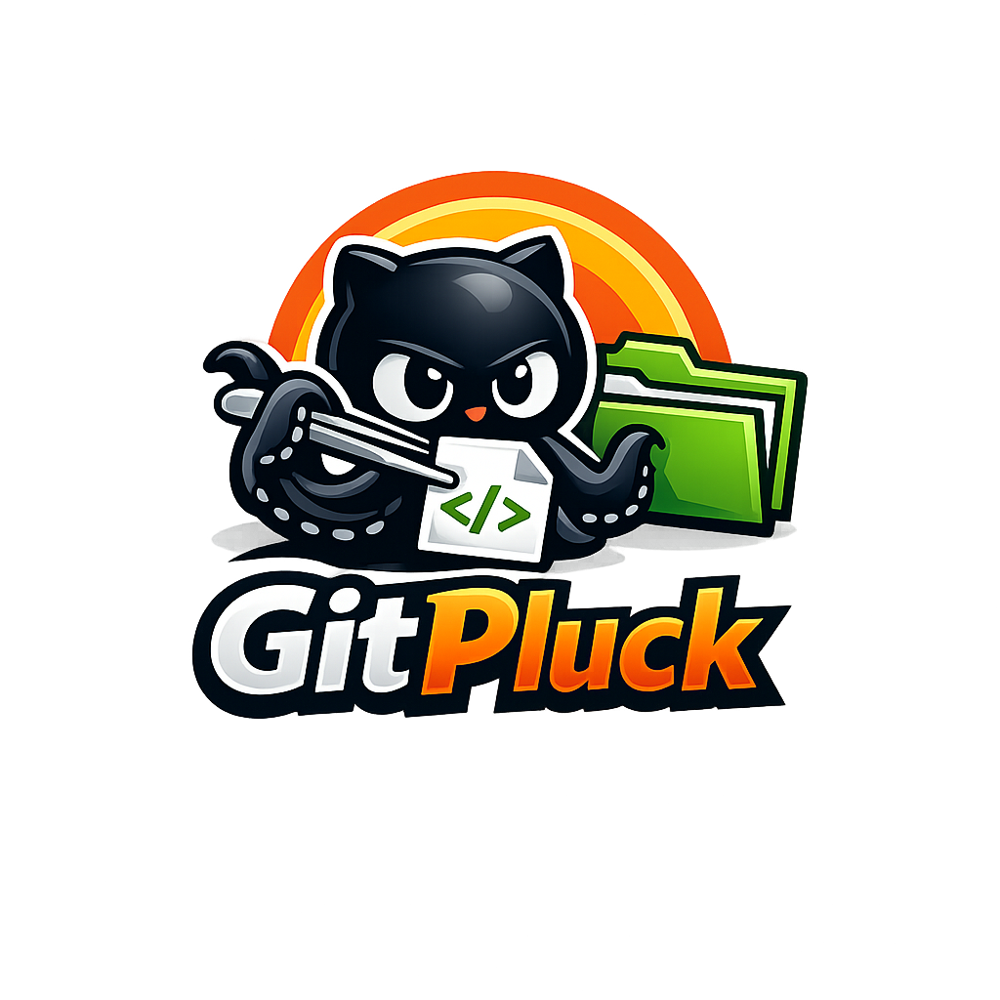

<p align="center">
  
</p>

<p align="center">
  <a href="https://swift.org">
    
  </a>
  <a href="https://swift.org/package-manager/">
    
  </a>
  
</p>

# GitPluck

*Читать на других языках: [English](README.md)*

`GitPluck` — консольная Swift-утилита для точечного скачивания файлов и папок из GitHub-репозитория без полного `git clone`.

Утилита загружает дерево репозитория через GitHub API, позволяет ходить по папкам в терминале, выбирать только нужные пути и скачивает выбранные элементы с сохранением структуры директорий.

## Ключевые возможности

- Выбор отдельных файлов и папок из GitHub-репозитория.
- Вход в папки и выход на уровень выше прямо из консоли.
- Поиск по путям репозитория.
- Preview первых 16 KB текстового файла перед скачиванием.
- Скачивание выбранных папок как набора вложенных файлов.
- GitHub token через флаг, переменную окружения или GitHub CLI.
- Swift Package Manager без сторонних runtime-зависимостей.

## Быстрый старт

```bash
swift run GitPluck https://github.com/octocat/Hello-World
```

Внутри браузера:

```text
e 1       # войти в пункт 1, если это папка; иначе выбрать файл
l         # выйти на уровень выше
1         # выбрать или снять выбор с пункта 1
d         # скачать выбранные элементы
q         # выйти
```

## Документация

- [Установка](Docs/ru/installation.md)
- [Быстрый старт](Docs/ru/quick-start.md)
- [Команды](Docs/ru/commands.md)
- [Настройка](Docs/ru/configuration.md)
- [Архитектура](Docs/ru/architecture.md)
- [Полная документация](Docs/ru/index.md)

## Базовое использование

```bash
# Открыть браузер репозитория
swift run GitPluck https://github.com/owner/repo

# Открыть подпапку репозитория
swift run GitPluck https://github.com/owner/repo/tree/main/Sources

# Скачать в указанную папку
swift run GitPluck https://github.com/owner/repo --out ./Downloads

# Скачать прямо в целевую папку без подпапки репозитория
swift run GitPluck https://github.com/owner/repo --out ./Downloads --no-folder

# Использовать GitHub token из GitHub CLI
swift run GitPluck https://github.com/owner/repo --token gh
```

## Требования

- Swift 6.0 или новее
- macOS 13 или новее
- Доступ к GitHub API и raw file URLs

## Структура проекта

```text
Sources/GitPluckCLI/    Консольное приложение и интерактивный браузер
Sources/GitPluckCore/   GitHub API, разрешение выбора, скачивание
Tests/                  Тесты ядра
Docs/                   Подробная документация
```
